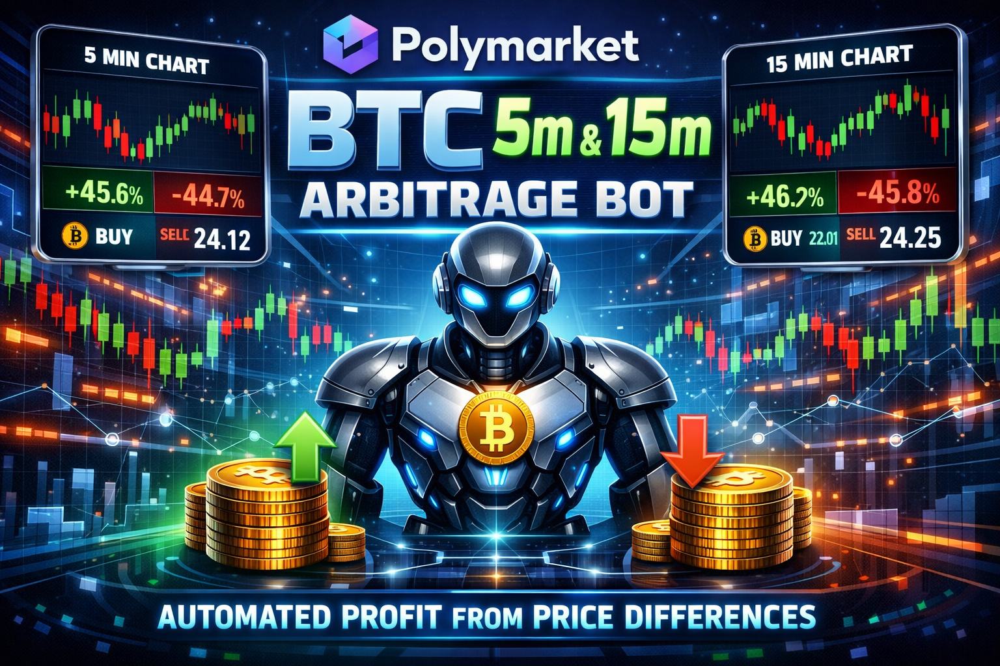

# Polymarket Arbitrage Bot

Polymarket **arbitrage bot** for 15-minute Up/Down markets. Automates the **dump-and-hedge** strategy with configurable thresholds, stop-loss hedging, and optional simulation mode. Full credential management, CLOB order execution, and market discovery via Gamma API.

[](https://nodejs.org/)
[](https://www.typescriptlang.org/)
[](LICENSE)





## 🎯 Overview

This **Polymarket arbitrage bot** runs a **dump-and-hedge** strategy on Polymarket’s 15m Up/Down markets (e.g. BTC, ETH, SOL, XRP) by:

- **Market discovery** – Finds the current 15m market per asset via Gamma API slug
- **Price monitoring** – Polls CLOB orderbooks for Up/Down bid/ask and time remaining
- **Dump detection** – In the first N minutes of each period, detects a sharp price drop on one side (Up or Down)
- **Leg 1** – Buys the dumped side at the dip
- **Hedge (Leg 2)** – Waits until combined cost (leg1 + opposite ask) is at or below target (e.g. ≤ 0.95), then buys the opposite side to lock in profit
- **Stop-loss hedge** – If the hedge condition isn’t met within a max wait time, hedges anyway to limit risk
- **Settlement** – On market close, redeems winning outcome tokens and tracks P&L
- **Simulation mode** – Run without placing real orders (default); switch to production when ready
- **Type-safe** – Full TypeScript with strict types and clear config via `.env`

Perfect for automating the dump-and-hedge arbitrage on Polymarket 15m markets with controllable risk and optional dry-run.

<!-- Add screenshots/demo images here -->
<!--


-->

## ✨ Key Features

### 🚀 Trading & Strategy
- **Dump-and-hedge** – Buy the dip on one outcome, then hedge when sum of prices ≤ target
- **Multi-market** – Supports multiple symbol/timeframe pairs (configurable via `ARBITRAGE_MARKETS`, e.g. `btc:5m,btc:15m`)
- **Automatic market discovery** – Resolves current 15m market by slug and period timestamp
- **Period rollover** – Detects new 15m periods and switches to the new market automatically
- **Stop-loss hedge** – Time-based fallback hedge if ideal hedge price isn’t reached

### 🛡️ Risk & Safety
- **Simulation by default** – No real orders until you set `PRODUCTION=true` or use `npm run prod`
- **Configurable sizing** – Shares per leg, sum target, move threshold, and watch window
- **Stop-loss parameters** – Max wait before forced hedge and stop-loss percentage
- **Position tracking** – Per-period and total P&L; redemption of winning tokens on close

### 🔧 Production-Ready
- **Env-based config** – All settings in `.env` (no config files to commit)
- **CLOB auth** – API key derivation from signer or optional explicit API key/secret/passphrase
- **Proxy wallet support** – Optional Polymarket proxy/profile address and signature type (EOA / Proxy / GnosisSafe)
- **History logging** – Append-only `history.toml` for audit and debugging
- **Graceful handling** – Continues monitoring on transient API errors; clear stderr logging

## 🚀 Quick Start

### Prerequisites

- **Node.js 16+** – [Download Node.js](https://nodejs.org/)
- **Polygon wallet** – With USDC for trading (production)
- **POL/MATIC** – For gas when redeeming winning tokens (production)

### Installation

```bash
# Clone the repository
git clone https://github.com/sitodowubb/polymarket-arbitrage-bot.git
cd polymarket-arbitrage-bot

# Install dependencies
npm install

# Build the project
npm run build
```

### Configuration

1. **Create environment file:**
```bash
cp .env.example .env
```

2. **Edit `.env` with your settings:**
```env
# Wallet + auth (required in live mode)
WALLET_PRIVATE_KEY=0x...              # Alias: PRIVATE_KEY
PROXY_WALLET_ADDRESS=0x...            # Required when SIGNATURE_TYPE=1 or 2 (Alias: FUNDER_ADDRESS)
SIGNATURE_TYPE=0                      # 0=EOA, 1=Proxy/Magic, 2=GnosisSafe

# APIs / chain
GAMMA_API_URL=https://gamma-api.polymarket.com
CLOB_API_URL=https://clob.polymarket.com # Alias: CLOB_HOST
CHAIN_ID=137
POLYGON_RPC_URL=https://polygon-rpc.com   # optional override for USDC preflight check
AMOY_RPC_URL=https://rpc-amoy.polygon.technology # optional, used when CHAIN_ID != 137

# Markets
ARBITRAGE_MARKETS=btc:5m,btc:15m

# Mode
SIMULATION_MODE=true                   # true=paper mode, false=live mode (Alias: PRODUCTION with inverse meaning)

# Strategy tuning
ARBITRAGE_CHECK_INTERVAL_MS=5000
ARBITRAGE_ORDER_USD=20
ARBITRAGE_OBI_DEPTH_LEVELS=5
ARBITRAGE_TREND_THRESHOLD=0.05
```

3. **Run the bot:**
```bash

# Development – run TypeScript with ts-node
npm run dev
```

Logs go to stderr and are appended to `history.toml`.

## ⚙️ Configuration Guide

### Environment Variables

These are the environment variables currently used by the code.

| Variable | Required | Description | Default |
|----------|----------|-------------|---------|
| `WALLET_PRIVATE_KEY` | Live mode | Private key used to sign CLOB requests. Alias: `PRIVATE_KEY` | - |
| `PROXY_WALLET_ADDRESS` | Live mode when `SIGNATURE_TYPE` is `1` or `2` | Polymarket proxy/profile wallet. Alias: `FUNDER_ADDRESS` | - |
| `SIGNATURE_TYPE` | No | `0` EOA, `1` Proxy/Magic, `2` GnosisSafe | `0` |
| `GAMMA_API_URL` | No | Gamma API base URL (used for market discovery + proxy validation) | `https://gamma-api.polymarket.com` |
| `CLOB_API_URL` | No | CLOB API base URL. Alias: `CLOB_HOST` | `https://clob.polymarket.com` |
| `CHAIN_ID` | No | Network chain id (`137` Polygon mainnet) | `137` |
| `POLYGON_RPC_URL` | No | RPC endpoint for Polygon USDC balance preflight check | `https://polygon-rpc.com` |
| `AMOY_RPC_URL` | No | RPC endpoint for Amoy (used when `CHAIN_ID != 137`) | `https://rpc-amoy.polygon.technology` |
| `SIMULATION_MODE` | No | `true` = paper mode, `false` = live orders | `false` |
| `PRODUCTION` | No | Backward-compatible alias of mode with inverse semantics (`true` => live) | `false` |
| `ARBITRAGE_MARKETS` | No | Comma-separated `symbol:timeframe` list | `btc:5m,btc:15m` |
| `ARBITRAGE_CHECK_INTERVAL_MS` | No | Poll interval in milliseconds | `5000` |
| `ARBITRAGE_ORDER_USD` | No | Order size in USDC per entry/switch action | `20` |
| `ARBITRAGE_OBI_DEPTH_LEVELS` | No | Orderbook bid depth levels used for OBI trend calc | `5` |
| `ARBITRAGE_TREND_THRESHOLD` | No | OBI threshold above/below neutral trend | `0.05` |

### Preflight checks (live mode)

Before trading starts, the bot validates:
- `PRIVATE_KEY` ↔ `PROXY_WALLET_ADDRESS` binding via Gamma `public-profile`
- USDC balance of trading wallet/proxy is `>= ARBITRAGE_ORDER_USD`

## 📖 How It Works

### Dump-and-hedge flow

1. **Discovery** – For each target in `ARBITRAGE_MARKETS`, the bot finds the active Up/Down market via Gamma slug matching.
2. **Monitoring** – Every `ARBITRAGE_CHECK_INTERVAL_MS`, it fetches YES/NO orderbooks and computes OBI trend from bid depth.
3. **Entry** – If no position: buy YES on uptrend, buy NO on downtrend.
4. **Neutral exit** – If trend is neutral and a position exists, sell current position.
5. **Trend-follow hold** – Hold YES on uptrend and hold NO on downtrend.
6. **Trend-flip switch** – If trend flips against the held side, sell and rotate into the new trend side.
7. **Preflight safety** – In live mode, validates key/proxy binding and checks USDC balance is at least `ARBITRAGE_ORDER_USD`.

### Simulation vs production

- **Simulation** (`SIMULATION_MODE=true`): no orders sent to the CLOB; strategy logic and logging run as normal.
- **Production** (`SIMULATION_MODE=false`): real orders sent to the CLOB. Requires `WALLET_PRIVATE_KEY`; set `PROXY_WALLET_ADDRESS` and `SIGNATURE_TYPE` for proxy/GnosisSafe accounts.

## 📦 Available Scripts

| Command | Description |
|---------|-------------|
| `npm run dev` | Run with ts-node |


## 🛠️ Troubleshooting

### Bot doesn’t find markets
- Confirm `ARBITRAGE_MARKETS` is valid `symbol:timeframe` pairs (example: `btc:5m,btc:15m`).
- Check network access to Gamma and CLOB APIs; try default `GAMMA_API_URL` and `CLOB_API_URL` first.

### Orders fail in production
- Ensure `WALLET_PRIVATE_KEY` is set and correct (hex, with or without `0x`).
- If using a proxy, set `PROXY_WALLET_ADDRESS` and `SIGNATURE_TYPE` (usually `2` for GnosisSafe).
- Verify USDC balance and that the market is still active and accepting orders.

### Redemption fails
- Ensure you have enough POL for gas on Polygon.
- Confirm the market is closed and resolved; the bot only redeems after resolution.

### Strategy not entering trades
- Lower `ARBITRAGE_TREND_THRESHOLD` if trend stays neutral too often.
- Increase `ARBITRAGE_OBI_DEPTH_LEVELS` to smooth noisy orderbook signals.


## 📚 Project structure

- `src/main.ts` – Entry point, config load, market discovery, and monitor/trader wiring.
- `src/config.ts` – Loads and validates `.env` into typed config.
- `src/api.ts` – Polymarket Gamma + CLOB API client (markets, orderbook, orders, redemption).
- `src/monitor.ts` – Fetches orderbook snapshots and drives the strategy callback.
- `src/dumpHedgeTrader.ts` – Dump detection, leg 1/2, stop-loss hedge, closure and P&L.
- `src/models.ts` – Shared types (Market, OrderBook, TokenPrice, etc.).
- `src/logger.ts` – History log and stderr output.
- `history.toml` – Append-only log (created at runtime; in `.gitignore`).


## ⚠️ Disclaimer

**IMPORTANT LEGAL DISCLAIMER:**

This software is provided “as-is” for educational and research purposes only. Trading on prediction markets involves substantial risk of loss.

- **No warranty** – The software is provided without any warranties.  
- **Use at your own risk** – You are solely responsible for any losses incurred.  
- **Not financial advice** – This is not investment or trading advice.  
- **Compliance** – Ensure compliance with local laws and regulations.  

The authors and contributors are not responsible for any financial losses, damages, or legal issues arising from the use of this software.


## 🌟 Star history

If you find this project useful, please consider giving it a star ⭐

## 📈 Roadmap

- [ ] Optional WebSocket orderbook updates for lower latency  
- [ ] Backtesting / replay mode for strategy tuning  
- [ ] Optional Telegram/Discord notifications  
- [ ] More timeframe support (e.g. 1h)  
- [ ] PnL export and simple reporting  
